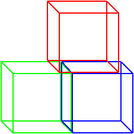

# systemPY



Python application component initialization system


[](https://systempy.readthedocs.io/en/latest/?badge=latest)

[](https://github.com/astral-sh/ruff)
[](https://mypy-lang.org/)

## The problem

The regular application contains many atomic components. Asyncio makes their
initializing a little bit complicated. It's OK, when you have a single entrypoint
and initialize your application components via your framework. While you add
new components to your application iteratively, you don't see any problem

When you create any new entrypoint, you have to think a lot, how to initialize
application components again, which callbacks should be called and in which
order. But it's a half of the problem! You have to implement also graceful
shutdown

The most painful part is one-time scripts. It's kind of The Banana Gorilla
Problem: you just want a banana but you have to initialize a gorilla holding the
banana and the entire jungle, and then gracefully shutdown it

## Solution

This library allows you to implement application startup and shutdown in a
declarative way. You have to implement a class for each your component,
write the startup and shutdown code. Then you have to combine required
components as mixins into the current application `App` class. Then create an
instance and pass dependencies as keyword arguments. In case it's a self-hosted
app you have to call the `instance.run_sync()` method

Note that `systempy` is **NOT** a di framework, but it may be used with any of
them. Also `systempy` is **NOT** a binding to systemd, but I was inspired by it
and `systempy` is doing similar things on a much smaller scale

It's possible to use `systemPY` in three scenarios:

- Secondary application, which is handled by another application like
  [celery](./examples/secondary/celery.md) or
  [starlette](./examples/secondary/starlette.md)

- Self-hosted application &#151 [scripts](./examples/self-hosted/scripting.md),
  [daemon](./examples/self-hosted/daemon.md), or
  [REPL](./examples/self-hosted/repl.md)

- [Primary](./examples/primary/write-me.md) application,
  handles other applications. Such as Gunicorn/Uvicorn/... or Celery

## Basic principles

There are 6 the most significant stages of the application lifecycle. Keep in
mind that we also need to be able do a safe application reload. Just look at the
[code](https://github.com/kai3341/systemPY/blob/main/systempy/target.py):

=== "Code"

    ```python
    from systempy import (
        DIRECTION,
        TargetMeta,
        register_target,
        register_target_method,
    )

    class Target(metaclass=TargetMeta):
        @register_target_method(DIRECTION.FORWARD)
        def on_init(self) -> None: ...

        @register_target_method(DIRECTION.FORWARD)
        def pre_startup(self) -> None: ...

        @register_target_method(DIRECTION.FORWARD)
        async def on_startup(self) -> None: ...

        @register_target_method(DIRECTION.BACKWARD)
        async def on_shutdown(self) -> None: ...

        @register_target_method(DIRECTION.BACKWARD)
        def post_shutdown(self) -> None: ...

        @register_target_method(DIRECTION.BACKWARD)
        def on_exit(self) -> None: ...
    ```

=== "Methods"

    * `on_init` is called exactly once on the application startup

    * `pre_startup` is called before the event loop is started

    * `on_startup` is called exactly when event loop has started

    * `on_shutdown` is called when the application is going to shutdown or
    reload but the event loop is still working

    * `post_shutdown` is called after event loop has stopped or drained. When
    application is going to reload, next it would be called `pre_startup`

    * `on_exit` is called exactly once when application is going to stop

=== "Target & Unit"

    Target idea is similar to `systemd`'s targets. Keep in mind such examples
    like `graphical.target` or `multi-user.target`. It means that we have to
    reach all pre-required targets to achieve this target

    `Systemd`'s `Unit`s are bound to target. `Target` is a reason of `Unit`
    execution

    Now about `systemPY`. To bind your component `Unit` to `Target`, you have
    to subclass this `Target`. After subclassing the `Target` your IDE will
    prompt you in defining your `Unit` component's methods &#151 it's just
    overriding `Target`'s methods. It's similar to `abc.ABC`, but everything is
    optional.

=== "`@register`'s"

    The last but not least is the `register_target_method`. It defines the type
    of this method and execution order for overriding of this method in
    subclassed `Unit` components. When you define a synchronous method,
    overriding it by an asynchronous method will cause an error

    Funny fact: mypy would cause the warning if you override asynchronous method
    with a synchronous one. But it's a false-positive warning and this code will
    work. As mypy causes a warning here, I think nobody will use this feature

    Payload execution order may be `DIRECTION.FORWARD`, `DIRECTION.BACKWARD` and
    `DIRECTION.GATHER`. Typically you should use `DIRECTION.FORWARD` on
    initialization and `DIRECTION.BACKWARD` on shutdown

    Also you may use `DIRECTION.GATHER` direction. Registered callbacks will be
    handled by `asyncio.gather` and will be executed in arbitrary order. You are
    able to use here both synchronous and asynchronous methods

    Also there are available `register_hook_before` and `register_hook_after`.
    Use them to extend existing `Target`s. Please have a look in the
    [`Target`](./examples//target/custom-target.md) section for more information


### Naming and roles

All the magic happens in `TargetMeta` metaclass. The `TargetMeta` is a subclass
of `abc.ABCMeta`, that's why you are able to to use `@abc.abstractmethod`
decorator

=== "Class roles"

    There are 6 roles of classes I found:

    * `Target` &#151 the interface which defines lifecycle methods

    * `Unit` &#151 component with lifecycle methods

    * `Mixin` &#151 class **without** lifecycle methods. It's special
    optimization of `Target` role

    * `App` &#151 the final "baked" class with composed lifecycle methods. Since
    `systempy>=0.1.7` it's allowed to subclass them too

    * `Builtins` &#151 a special optimization to force skipping `builtins`
    classes processing by `libsystempy`. Normally you wouldn't face it

    * `Metaclass` &#151 the same kind of optimization as `Builtins`, but used by
    `TargetMeta` and its subclasses. It happens automatically in the
    `__init_subclass__` hook

    `TargetMeta` checks `role` kwarg. If kwarg `role` is not defined,
    `TargetMeta` tries to parse class name and decide what to do

=== "by naming"

    Here we are trying to manipulate class roles by class names. It's very
    similar to the idea of [tailwind-css](https://tailwindcss.com/). You don't
    have to do any extra import, just follow class naming rules and be happy:

    * Classes with names, ends with `Target` or `TargetABC` / matches
    `r'(\S*)Target(ABC)?$'`, will be interpreted as a `Target` role

    * Classes with names, ends with `Unit` or `UnitABC` / matches
    `r'(\S*)Unit(ABC)?$'`, will be interpreted as an `Unit` role

    * Classes with names, ends with `Mixin` or `MixinABC` / matches
    `r'(\S*)Mixin(ABC)?$'`, will be interpreted as a `Mixin` role. Remember: the
    `Mixin` role is a special optimization of the `Target` role which means that
    the class **does not have own lifecycle methods**

    * Classes with names, ends with `App` / matches `r'(\S*)App$'`, will be
    interpreted as an `App` role. Due App role does not allow subclassing,
    AppABC has no sense

    ```python
    from systempy import Target

    class MyTarget(Target): ...  # OK
    class TargetMy(Target): ...  # ERROR

    class MyMixin(Target): ...  # OK
    class MixinMy(Target): ...  # ERROR
    class MyMixinABC(Target): ...  # OK
    class MixinABCMy(Target): ...  # ERROR

    class MyUnit(Target): ...  # OK
    class UnitMy(Target): ...  # ERROR

    class MyApp(MyUnit): ...  # OK
    class MyApplication(MyUnit): ...  # ERROR
    ```

=== "by `role` kwarg"

    Sometimes you may prefer to pass to the class the explicit role. You can
    find such examples in `systempy` code base too. When you are passing the
    `role` kwarg, `systempy` doesn't try to parse class name:

    ```python
    from systempy import ROLE, Target

    class MyTargetExample(Target, role=ROLE.TARGET): ... # OK
    class MyBlahblahblah(Target, role=ROLE.MIXIN): ...  # OK
    class MyFooDB(Target, role=ROLE.UNIT): ...  # OK
    class MyBar(MyFooDB, role=ROLE.APP): ...  # OK
    ```


## That's all? Nope, it's the very beginning!

You are able to register own `Target` with your own lifecycle methods. The first
such example is [already included](https://github.com/kai3341/systemPY/blob/main/systempy/ext/target_ext.py):

=== "Code"

    ```python
    from systempy import (
        DIRECTION,
        Target,
        register_hook_after,
        register_hook_before,
    )

    class ExtTarget(Target):
        @register_hook_after(Target.on_startup, DIRECTION.FORWARD)
        async def post_startup(self) -> None: ...

        @register_hook_before(Target.on_shutdown, DIRECTION.BACKWARD)
        async def pre_shutdown(self) -> None: ...
    ```

=== "Methods"

    Here two new lifecycle methods there were registered:

    * `post_startup` callbacks will be called exactly after finished
    `Target.on_startup` in a `DIRECTION.FORWARD` order

    * `pre_shutdown` callbacks will be called before running
    `Target.on_shutdown` in a `DIRECTION.BACKWARD` order

You are able to define your own lifecycle stages without any limit by binding
them before or after already existing. It's like `systemd`'s `Unit` options
`Before` and `After`. Yes, [`systemPY` is a small `systemd`'s brother](https://telegra.ph/Why-does-it-systemPY-08-12)

You can find more examples. Actually the whole `systempy` itself is the example
of `libsystempy` usage. Don't be afraid to read `systempy`'s source code

## Method Resolve Order

I'll explain on the part of [REPL](./examples/self-hosted/repl.md) example:

```python
class MyReplApp(    # INIT      # SHUTDOWN
    ConfigUnit,     # 1         # 6
    LoggerUnit,     # 2         # 5
    MyFirstDBUnit,  # 3         # 4
    RedisUnit,      # 4         # 3
    PTReplUnit,     # 5         # 2
): ...              # 6         # 1
```

Important: while you are implementing your `Unit` mixins, remember **NEVER**
call `super()` in lifecycle methods. These methods will be collected and called
by `systemPY` in the right order

# Installing

Install `systemPY` from [PyPI](https://pypi.org/project/systemPY/) **OR**
from [github repository](https://github.com/kai3341/systemPY):

=== "pip"

    ```sh
    pip install systemPY
    ```

    **OR**

    ```sh
    pip install git+https://github.com/kai3341/systemPY.git
    ```

=== "uv"

    ```sh
    uv add systemPY
    ```

    **OR**

    ```sh
    uv add git+https://github.com/kai3341/systemPY
    ```
