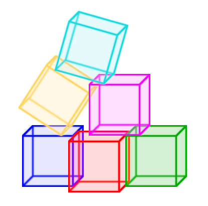

# systemPY



Python application component initialization system


[](https://systempy.readthedocs.io/en/latest/?badge=latest)


## The problem

The regular application contain many atomic components. Asyncio makes theirs
initializing a little bit complicated. It's OK, when you have single entrypoint
and initialize your application components via your framework. While you add
new components to your application iteratively, you don't see any problem

When you create any new entrypoint, you have to think a lot, how to initialize
application components again, which callbacks should be called and in which
order. But it's a half of the problem! You have to implement also graceful
shutdown

The most painful part is one-time scripts. It's kind of The Banana Gorilla
Problem: you wanted a banana but you have to initialize a gorilla holding the
banana and the entire jungle, and then graceful shutdown it

## Solution

This library allows you to implement application startup and shutdown in
declarative way. You have to implement a class for each your component,
write the startup and shutdown code. Then combine required components as
mixins into the current application `Unit` class. Then create an instance
and pass dependencies as keyword arguments. In case it's daemon run
`instance.run_sync()` methed

It's possible to use `systemPY` in three scenarios:

* Secondary application, which is handled by another application like
[celery](examples/secondary/celery.md) or
[starlette](examples/secondary/starlette.md)

* Self-hosted application -- [daemon](examples/self-hosted/daemon.md),
[script](examples/self-hosted/script.md) or
[REPL](examples/self-hosted/repl.md)

* [Primary](examples/primary/write-me.md) application,
handles other applications. Such as Gunicorn/Uvicorn/... or Celery

## Basic principles

There are 6 the most valueable lifecycle stages. Keep in mind we need in safe
application reload. Just looks the
[code](https://github.com/kai3341/systemPY/blob/main/systempy/target.py):

```python
@util.register_target
class Target:
    @util.register_target_method("forward")
    def on_init(self) -> None: ...

    @util.register_target_method("forward")
    def pre_startup(self) -> None: ...

    @util.register_target_method("forward")
    async def on_startup(self) -> None: ...

    @util.register_target_method("backward")
    async def on_shutdown(self) -> None: ...

    @util.register_target_method("backward")
    def post_shutdown(self) -> None: ...

    @util.register_target_method("backward")
    def on_exit(self) -> None: ...
```

### Let's start from methods:

* `on_init` executes exactly once on application startup

* `pre_startup` is called before event loop startup

* `on_startup` is called exactly when event loop started

* `on_shutdown` is called when application is going shutdown or reload but
event loop still working

* `post_shutdown` is called after event loop stopped or drained. When
application is going to reload, then it should be called `pre_startup`

* `on_exit` executes exactly once when application is stopping

### That are `Target`, `Unit`, `register_target` and `register_target_method`?

Target idea is similar to `systemd`'s targets. Keep in mind such examples like
`graphical.target` or `multi-user.target`. It means to achieve this target we
have to reach all pre-required targets

`Systemd`'s `Unit`s are bound to target. `Target` is a reason of `Unit`
execution

Now about `systemPY`. To bind `Unit` to `Target`, you have to subclass it.
After subclassing IDE promting you in defining the `Unit` methods -- it's just
overriding `Target`'s methods. It's similar to `abc`, but everything is
optional.

The last but not the least is `register_target_method`. It defines method's
type and payload method execution order. When you define syncronous method,
overriding it by asyncronous method will cause an error

Payload execution order may be `"forward"`, `"backward"` and `"gather"`.
Typically you should use `"forward"` on initialization and `"backward"` on
shutdown

Also you may use `"gather"` direction. Registered callbacks will be handled by
`asyncio.gather` and will be executed in arbitrary order

### That's all? Nope, it's really begin

You are able to register own `Target` with own
lifecycle methods. The first such example is
[already included](https://github.com/kai3341/systemPY/blob/main/systempy/ext/target_ext.py).

```python
@util.register_target
class TargetExt(Target):
    @util.register_hook_after(Target.on_startup)
    @util.register_target_method("forward")
    async def post_startup(self) -> None: ...

    @util.register_hook_before(Target.on_shutdown)
    @util.register_target_method("backward")
    async def pre_shutdown(self) -> None: ...
```

Here there were registered two new lifecycle methods:

* `post_startup` callbacks will be called exactly after finished
`Target.on_startup` in `"forward"` order

* `pre_shutdown` callbacks will be called before running `Target.on_shutdown`
in `"backward"` order

You are able to define your own lifecycle stages without any limit binding
before or after existing. It's like `systemd`'s `Unit` options `Before` and
`After`. Yes, `systemPY` is a small `systemd`'s brother

## Installing

Install `systemPY` from PyPI:

```
pip install systemPY
```

You also able to install the latest version from github repository:

```
pip install git+https://github.com/kai3341/systemPY.git
```

